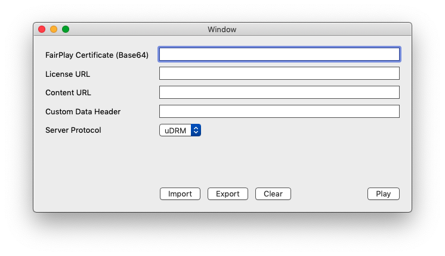

# Mac Player

This is a simple macOS application that uses AVPlayer to play HLS assets, with or without FairPlay protection.

**Mac Player is not a PlayKit sample** - it's intended as a diagnistics tool: a core Apple player that **doesn't** use PlayKit. 

## Usage

### Build

Open the Xcode project and build MacPlayer target on "My Mac". The only dependencies are on built-in Apple frameworks (Cocoa, Foundation, AVKit, AVFoundation).

### Usage

When the app is launched, the following dialog shows:

#### Primary fields

- **FairPlay Certificate**: the Apple-provided FairPlay certificate in Base64
- **License URL**: the URL of a license server, with any required parameters
- **Content URL**: URL of the asset to be played

If FairPlay Certificate and License URL are not provided, the content is assumed to be non-FairPlay, but an error will occur if it is.

#### DRM Server Protocol

By default, the player uses Kaltura's uDRM. In that case, leave Custom Data header blank and don't change Server Protocol.

There's another DRM server protocol supported: sending the SPC payload as an HTML form (form-urlencoded). When using this protocol, you may also set Custom Data Header.

#### Play

Click Play to start playing the content. Messages from the player (events, errors and warnings) are displayed on the right side of the window.

Each type of message is prefixed by an emoji:

- 😎 Normal flow (informative messages)
- ⚠️ Warning (a non-fatal error)
- ‼️ Fatal error (playback will stop)

Close the playback window to go back to the dialog to select another asset or change parameters.

